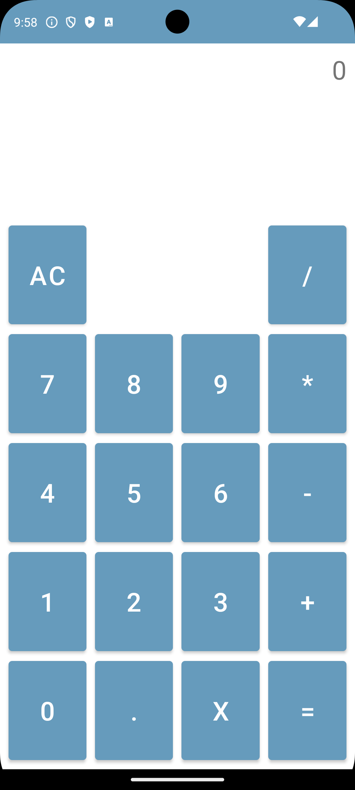
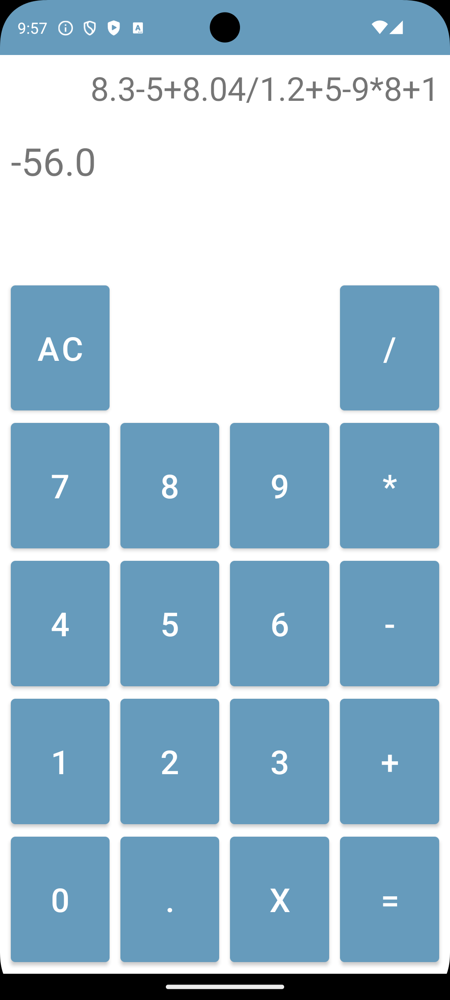

# Simple Calculator

## Overview
This is a simple calculator app developed using Kotlin for Android. It provides basic arithmetic operations including addition, subtraction, multiplication, and division, along with a clear, erase, and decimal point feature. The app is designed with a straightforward user interface, making it easy to use for performing quick calculations.

## Features
- **Basic Arithmetic Operations**: Supports addition, subtraction, multiplication, and division.
- **Clear and Erase**: Easily clear the entire input or erase the last digit.
- **Decimal Support**: Perform calculations with decimal numbers.
- **Dynamic Input Display**: The input and the result are displayed in real-time.

## Tech Stack
- **Language**: Kotlin
- **UI Framework**: Android Views (using `LinearLayout`, `TextView`, and `Button`)
- **IDE**: Android Studio
- **Build Tool**: Gradle

## Code Structure
- **MainActivity.kt**: Contains the logic for handling button clicks and performing calculations.
- **XML Layouts**: Defines the user interface layout using `LinearLayout`, `TextView`, and `Button` elements for input and operations.

## Screenshot

## License
This project is open-source and available under the MIT License.
# simpleCalculator
